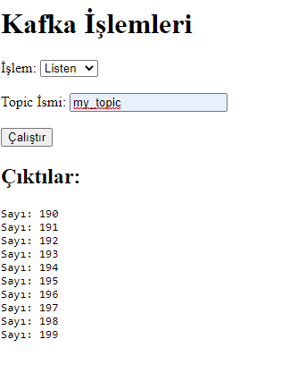

# KafkaUI

Ornek kurulum GCP

Ubuntu 22.04 LTS x86/64 lı bir makine

> wget https://archive.apache.org/dist/kafka/3.3.1/kafka_2.12-3.3.1.tgz

>sudo apt-get update

>sudo apt-get install openjdk-8-jdk

>tar -xzvf kafka_2.12-3.3.1.tgz

>cd kafka_2.12-3.3.1/

>sudo nohup bin/zookeeper-server-start.sh config/zookeeper.properties &

>sudo nohup bin/kafka-server-start.sh config/server.properties &

>sudo bin/kafka-topics.sh --create --topic ornek --bootstrap-server localhost:9092

>sudo bin/kafka-topics.sh --list --bootstrap-server localhost:9092

>cd ..

> sudo apt install python3-pip

> pip install fastapi

> pip install python-multipart

> pip install uvicorn

>nohup python3 kafka_gonder.py

>python3 proje.py

